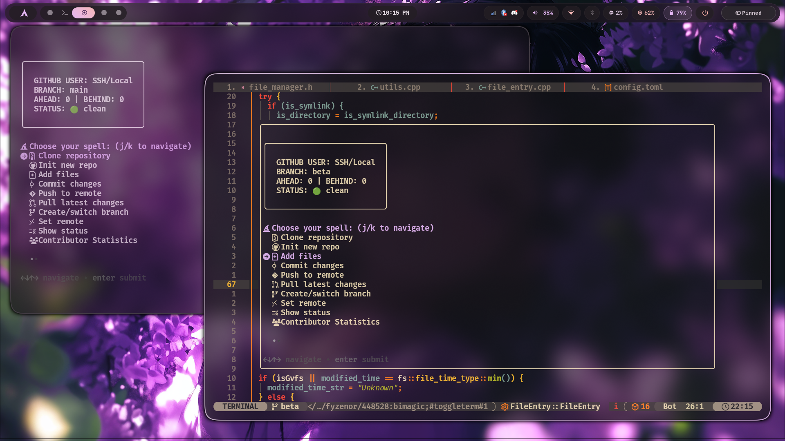
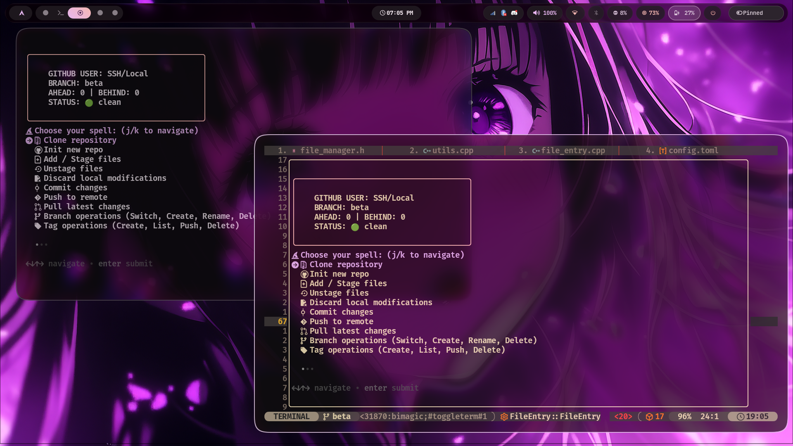

# Bimagic v2.0.0 - The Go-Powered Git Wizard 🔮

<p align="center">
  
</p>

<p align="center">By Bimbok and adityapaul26</p>

A powerful, multi-threaded, Go-based Git automation tool that simplifies your GitHub workflow with an interactive magic menu system.

## Overview

Bimagic is a lightning-fast, Go-powered interactive command-line tool that streamlines common and advanced Git operations, making version control accessible through a user-friendly menu interface. Rebuilt in **Go** for maximum speed (sub-5ms rendering), multi-threaded performance, and cross-platform reliability, it handles repository initialization, committing, branching, tag management, diff inspection, cherry-picking, stash operations, reflog recovery, and interactive sparse checkouts with GitHub integration using personal access tokens or SSH.

## Sample


<p align="center">Interactive magic spell menu with custom theme styling</p>


<p align="center">Interactive confirmation dialog with dynamic button themes</p>

## Features

- 󱐋 **Multi-Threaded Speed Engine**: Multi-core CPU parallelism (`runtime.GOMAXPROCS` & `sync.WaitGroup`) rendering status dashboards in **5ms**.
- 📦 **Modular Package Architecture**: Clean domain separation (`pkg/config`, `pkg/ui`, `pkg/git`, `pkg/spells`) for maximum stability and maintainability.
- 🪄 **Shortcut Symlink (`wz`)**: Automatically provisions `wz -> bimagic` shortcut symlinks during installation. Run with `bimagic` or `wz`!
- 🎨 **Full Theme Adaptation**: Every button, prompt, selector, input box, and modal dynamically inherits colors from `~/.config/bimagic/theme.wz`.
- 🔮 **Interactive Menu-Driven Interface**: Driven by Charm's `gum` with Nerd Font iconography.
- 🔐 **Secure GitHub Auth**: Integration via personal access tokens or SSH.
- 📦 **Instant Initialization**: Setup new repositories guaranteed with `main` branch default (`git init -b main`).
- 📥 **Smart & Sparse Cloning**: Standard clone or interactive file selection (`--filter=blob:none`).
- 📊 **Real-time Progress Bar**: Visual feedback for git object downloads and delta resolution.
- 🗜️ **Shallow Clone Support**: Use `--depth` for lightweight clones.
- 🔄 **Simplified Remote Ops**: Automated push/pull and upstream tracking.
- 🌿 **Branch Management Made Easy**: Create, switch, rename (`-m`), and delete (`-d`/`-D`) local branches.
- 📊 **Status Dashboard**: Single-pass `porcelain=v2` status box showing ahead/behind counts, branch state, and merge conflict warnings.
- ↩️ **Unstage Files Wizard**: Interactive multi-select unstaging (`git restore --staged`).
- 🧹 **Discard Local Modifications**: Safe interactive discard of uncommitted changes (`git checkout --`).
- 🏷️ **Tag Mastery**: Complete tag lifecycle (create annotated/lightweight, list, push, delete local & remote tags).
- 🔍 **Diff & Inspection Wizard**: Interactive viewer for unstaged diffs, staged diffs, file diffs, and branch comparisons.
- 🍒 **Cherry-Pick Wizard**: Select and apply commits onto current branch with conflict resolution.
- 🛡️ **Safe File Management**: Intelligent file/folder removal (`git rm -rf` for tracked, `rm -rf` for untracked).
- 📈 **Contributor Statistics**: Per-author contribution activity (lines, commits, highlights) over custom timeframes.
- 🌐 **Git Graph Viewer**: Colorized tree log visualization of repository history.
- 📜 **The Architect**: Interactive `.gitignore` generator with 70+ industry blueprints.
- 🔀 **Merge Magic**: Branch merging with interactive selection and conflict detection.
- ⏪ **Revert Spells**: Multi-select commit revert with conflict warnings.
- 🪨 **Resurrection Stone**: Recover deleted commits or branches directly from the Git reflog.
- ⏳ **Time Turner**: Undo recent commits with Soft, Mixed, or Hard level resets.
- 🗃️ **Stash Operations**: Complete control over Git stashes (Push, Pop, List, Apply, Drop, Clear).
- 🔍 **The Scrying Glass**: Instant file preview with `fzf` side-by-side preview & `bat` syntax highlighting.
- ⚡ **Command Transparency**: Displays the exact Git commands being executed.

## Installation

### Windows Installation Guide 🪟

Bimagic runs natively on Windows 10/11 inside **Windows Terminal**, **PowerShell**, **Command Prompt**, or **Git Bash** without requiring WSL or Linux emulation.

#### Step 1: Install Dependencies (`gum`)

Install Charm's `gum` UI engine using your preferred Windows package manager in PowerShell:

```powershell
# Using Winget (Recommended)
winget install charmbracelet.gum

# OR using Scoop
scoop install gum

# OR using Chocolatey
choco install gum
```

#### Step 2: Download or Build `bimagic.exe`

**Option A: Download Pre-built Executable**
- Download `bimagic.exe` directly from [GitHub Releases](https://github.com/bimagic/bimagic-go/releases).

**Option B: Install via Go**
```powershell
go install github.com/bimagic/bimagic-go@latest
```

**Option C: Build from Source**
```powershell
git clone https://github.com/bimagic/bimagic-go.git
cd bimagic-go
go build -ldflags="-s -w" -o bimagic.exe main.go
```

#### Step 3: Add to System PATH & Set `wz` Alias

1. Create a folder (e.g. `C:\Users\YourName\bin`) and copy `bimagic.exe` into it.
2. Add `C:\Users\YourName\bin` to your User Environment Variables **Path**.
3. Open your PowerShell Profile to configure the `wz` shortcut alias and `Ctrl + B` keybinding:
   ```powershell
   notepad $PROFILE
   ```
4. Append the following lines:
   ```powershell
   # Bimagic PowerShell Shortcut & Keybinding
   Set-Alias wz bimagic.exe
   Set-PSReadLineKeyHandler -Key "Ctrl+b" -ScriptBlock {
       [Microsoft.PowerShell.PSConsoleReadLine]::Insert("wz")
       [Microsoft.PowerShell.PSConsoleReadLine]::AcceptLine()
   }
   ```
5. Save the file and restart PowerShell. Now run `bimagic` or `wz` or press **Ctrl + B**!

---

### Automated Installer for Linux / macOS (Recommended)

Run this one-line command to install Bimagic:

```bash
curl -fsSL https://raw.githubusercontent.com/bimagic/bimagic-go/main/install.sh | bash
```

Or run locally from a cloned repository:

```bash
./install.sh
```

*(Use `--system` flag to install into `/usr/local/bin` for all users, or default to `~/.local/bin` without root).*

### Quick Access (Keybinding)

The installer automatically supports setting up a **Ctrl + B** keybinding for **Zsh**, **Bash**, and **Fish** shells. This allows you to summon the Git Wizard from anywhere in your terminal instantly!

- **Zsh**: Add to `~/.zshrc`:
  ```zsh
  bimagic-widget() { wz; zle redisplay }
  zle -N bimagic-widget
  bindkey '^B' bimagic-widget
  ```
- **Bash**: Add to `~/.bashrc`:
  ```bash
  bind -x '"\C-b": wz'
  ```
- **Fish**: Add to `~/.config/fish/config.fish`:
  ```fish
  bind \cb 'wz; commandline -f repaint'
  ```

_Note: Restart your terminal or source your config file (e.g., `source ~/.zshrc`) after installation for the keybinding to take effect._

### Neovim Integration

You can use Bimagic directly inside Neovim! This integration wraps the CLI tool in a floating terminal window using `toggleterm.nvim` for a seamless workflow.

#### LazyVim / Toggleterm Setup

Create a new plugin file (e.g., `~/.config/nvim/lua/plugins/bimagic.lua`) with the following configuration. This sets up a `<leader>gm` keybinding to launch the wizard in a floating popup.

```lua
return {
  {
    "akinsho/toggleterm.nvim",
    opts = function(_, opts)
      opts.size = 20
      opts.open_mapping = [[<c-\>]]
    end,
    keys = {
      {
        "<leader>gm",
        function()
          local Terminal = require("toggleterm.terminal").Terminal
          local bimagic = Terminal:new({
            cmd = "wz", -- Uses 'wz' or 'bimagic' in global PATH
            hidden = true,
            direction = "float",
            float_opts = {
              border = "curved", -- 'single', 'double', 'shadow', 'curved'
              width = 100,
              height = 25,
              title = "  Bimagic Git Wizard ",
            },
            close_on_exit = true,

            on_open = function(term)
              vim.cmd("startinsert!")
              vim.api.nvim_buf_set_keymap(term.bufnr, "n", "q", "<cmd>close<CR>", { noremap = true, silent = true })
            end,
          })
          bimagic:toggle()
        end,
        desc = "Bimagic (Git Wizard)",
      },
    },
  },
}
```

### From Source (Requires Go)

If you have Go installed, you can install Bimagic directly:

```bash
go install github.com/bimagic/bimagic-go@latest
```

### Manual Installation

1. Clone the repository:
```bash
git clone https://github.com/bimagic/bimagic-go.git
```

2. Build the binary:
```bash
go build -ldflags="-s -w" -o bimagic main.go
```

3. Move it to your PATH and create `wz` shortcut symlink:
```bash
# Option 1: For user-local installation (no sudo required)
mkdir -p ~/.local/bin
mv bimagic ~/.local/bin/
ln -sf ~/.local/bin/bimagic ~/.local/bin/wz

# Option 2: For system-wide installation (requires sudo)
sudo mv bimagic /usr/local/bin/
sudo ln -sf /usr/local/bin/bimagic /usr/local/bin/wz
```

4. Ensure the bin directory is in your PATH (add to `~/.bashrc` or `~/.zshrc` if needed):
```bash
export PATH="$HOME/.local/bin:$PATH"  # For user-local installation
```

## Dependencies

- **[gum](https://github.com/charmbracelet/gum)** (Required): Powers the interactive TUI elements.
  - Automatically installed by `install.sh` on supported platforms.
  - If not installed, interactive menus will prompt for installation.
- **Git** (Required): The engine behind the magic.
- **[bat](https://github.com/sharkdp/bat)** (Optional): Used for syntax highlighting in The Scrying Glass.
- **[fzf](https://github.com/junegunn/fzf)** (Optional): Used for side-by-side file selection previews.

## Configuration

### Setting Up GitHub Credentials

Bimagic requires your GitHub username and a personal access token for HTTPS remotes. Add these to your shell configuration file:

1. Open your shell configuration file:
```bash
# For bash users
nano ~/.bashrc

# For zsh users
nano ~/.zshrc
```

2. Add these lines at the end of the file:
```bash
# GitHub credentials for bimagic
export GITHUB_USER="your_github_username"
export GITHUB_TOKEN="your_github_personal_access_token"
```

3. Reload your shell configuration:
```bash
source ~/.bashrc  # or source ~/.zshrc
```

### Theme Customization 🎨

Bimagic allows you to fully customize the UI colors through a theme file.

1. **Location**: The theme file is located at `~/.config/bimagic/theme.wz`.
2. **Formats**: You can use **ANSI color numbers (0-255)** or **Hex codes (#RRGGBB)**.
3. **TrueColor Support**: Hex codes will automatically enable TrueColor mode in supported terminals.

#### Example `theme.wz`:

```bash
# Bimagic Theme - Arctic Neon
# Copy this to ~/.config/bimagic/theme.wz

# Primary color - Neon Cyan
BIMAGIC_PRIMARY="#00FFFF"

# Secondary color - Deep Sky Blue
BIMAGIC_SECONDARY="#00AFFF"

# Success color - Spring Green
BIMAGIC_SUCCESS="#00FF87"

# Error color - Hot Pink
BIMAGIC_ERROR="#FF005F"

# Warning color - Amber
BIMAGIC_WARNING="#FFD700"

# Info color - Seafoam
BIMAGIC_INFO="#00FFAF"

# Muted color - Steel Grey
BIMAGIC_MUTED="243"

# Banner Gradients (Deep Blue to Cyan)
BANNER_COLOR_1="51"
BANNER_COLOR_2="45"
BANNER_COLOR_3="39"
BANNER_COLOR_4="99"
BANNER_COLOR_5="135"
```

### Matugen integration

#### Step 1: Create the Matugen Template for Bimagic

Create a new file at `~/.config/matugen/templates/bimagic-theme.wz`:

```bash
# Bimagic Theme - Generated by Matugen
# Do not edit manually!

BIMAGIC_PRIMARY="{{colors.primary.default.hex}}"
BIMAGIC_SECONDARY="{{colors.secondary.default.hex}}"

# Material You doesn't have strict 'success/warning', so we map them to complementary accent colors
BIMAGIC_SUCCESS="{{colors.tertiary.default.hex}}"
BIMAGIC_ERROR="{{colors.error.default.hex}}"
BIMAGIC_WARNING="{{colors.tertiary_container.default.hex}}"
BIMAGIC_INFO="{{colors.primary_container.default.hex}}"

# Muted colors for hints
BIMAGIC_MUTED="{{colors.outline.default.hex}}"

# Banner Gradients (Creating a smooth transition using Material shades)
BANNER_COLOR_1="{{colors.primary.default.hex}}"
BANNER_COLOR_2="{{colors.primary_fixed.default.hex}}"
BANNER_COLOR_3="{{colors.secondary.default.hex}}"
BANNER_COLOR_4="{{colors.secondary_fixed.default.hex}}"
BANNER_COLOR_5="{{colors.tertiary.default.hex}}"
```

#### Step 2: Update your Matugen Config

Open your Matugen config (usually `~/.config/matugen/config.toml`) and add this block to the bottom:

```toml
[templates.bimagic]
input_path = "~/.config/matugen/templates/bimagic-theme.wz"
output_path = "~/.config/bimagic/theme.wz"
```

#### Step 3: Test the Magic

Run your usual matugen command to generate colors from your current wallpaper. For example:

```bash
matugen image /path/to/your/wallpaper.jpg
```

### Creating a GitHub Personal Access Token

1. Go to GitHub → Settings → Developer settings → Personal access tokens
2. Click "Generate new token (classic)"
3. Give your token a descriptive name (e.g., "bimagic-cli")
4. Select the "repo" scope (this provides full control of private repositories)
5. Click "Generate token"
6. Copy the token immediately (you won't be able to see it again!)

## Usage

Simply run the `bimagic` command in your terminal:

```bash
bimagic
```

**Pro Tip:**

- Press **Ctrl + B** in your terminal to quickly summon the wizard from anywhere!
- You can also use the short alias **wz** (Wizard) for even faster access!

```bash
wz
```

### Command Line Flags (Power User Direct Keymaps)

Power users can bypass the interactive menu by using direct keymap flags:

| Keymap Flag | Operation Description |
| :--- | :--- |
| `wz -d [url] [-i]` | **Clone Repository** (optional `-i` for interactive sparse checkout) |
| `wz -I` / `wz --init` | **Init New Repo** (guaranteed `main` branch default) |
| `wz -A` / `wz --add` | **Add / Stage Files** interactively |
| `wz -U` / `wz --unstage` | **Unstage Files** (`git restore --staged`) |
| `wz -X` / `wz --discard` | **Discard Local Modifications** (`git checkout --`) |
| `wz -c` / `wz --commit` | **Magic Commit Builder** (Conventional Commits specification) |
| `wz -P` / `wz --push` | **Push to Remote** (auto-configures upstream tracking) |
| `wz -p` / `wz --pull` | **Pull Latest Changes** from remote |
| `wz -b` / `wz --branch` | **Branch Operations** (switch, create, rename `-m`, delete `-d`/`-D`) |
| `wz -t` / `wz --tag` | **Tag Operations** (create, list, push, delete local & remote tags) |
| `wz -D` / `wz --diff` | **Diff & Inspection Wizard** (unstaged, staged, file, branch diffs) |
| `wz -C` / `wz --cherry` | **Cherry-Pick Wizard** (pluck commits onto current branch) |
| `wz -r` / `wz --remote` | **Set Remote** (configure HTTPS token or SSH remotes) |
| `wz -s` / `wz --status` | **Status Dashboard** (<5ms single-pass execution) |
| `wz -S` / `wz --stats` | **Contributor Statistics** (activity highlights & numstat analysis) |
| `wz -g` / `wz --graph` | **Git Graph** (pretty git log tree view) |
| `wz -a` / `wz --architect` | **Summon the Architect** (.gitignore generator with 70+ blueprints) |
| `wz -R` / `wz --remove` | **Remove Files/Folders** (safe `git rm` integration) |
| `wz -m` / `wz --merge` | **Merge Branches** (with conflict detection) |
| `wz --uninit` | **Uninitialize Repo** (remove `.git` tracking) |
| `wz -k` / `wz --resurrect` | **Resurrection Stone** (recover lost commits from reflog) |
| `wz -v` / `wz --revert` | **Revert Commit(s)** (multi-select revert) |
| `wz -w` / `wz --stash` | **Stash Operations** (push, pop, list, apply, drop, clear) |
| `wz -q` / `wz --quickview` | **The Scrying Glass** (instant file browser with `fzf` & `bat`) |
| `wz -u` / `wz --undo` | **Time Turner** (undo last commit: soft, mixed, hard) |
| `wz -z "message"` | **The Lazy Wizard** (Add + Commit + Push fast track) |
| `wz -h` / `wz --help` | **Show Direct Keymaps Help Menu** |

You'll be presented with an interactive menu if no flags are passed.

### Status Dashboard

At the top of the interface, a prominent status box summarizes:

- Current `GITHUB_USER` and branch
- Ahead/behind counts relative to upstream (`AHEAD: X | BEHIND: Y`)
- Working tree state: clean, uncommitted, or conflicts

### Menu Options

1. ** Clone repository** - Clone a repository from a URL (supports standard and interactive modes)
2. ** Init new repo** - Initialize a new Git repository (guaranteed `main` branch default)
3. ** Add / Stage files** - Stage files (interactive multi-select; includes `[ALL]`)
4. **󰁯 Unstage files** - Unstage files interactively (`git restore --staged`)
5. **󰮘 Discard local modifications** - Revert unstaged changes (`git checkout --`)
6. ** Commit changes** - Commit staged changes with Magic Commit (Conventional) or Quick Commit
7. ** Push to remote** - Push changes (handles multiple remotes and auto-configuration)
8. ** Pull latest changes** - Fetch and merge changes from remote
9. ** Branch operations** - Create, switch, rename (`-m`), or delete (`-d`/`-D`) branches
10. **󰓹 Tag operations** - Create, list, push, and delete local/remote tags
11. **󰈈 Diff & inspection wizard** - Inspect unstaged, staged, file diffs, or compare branches
12. ** Cherry-pick commits** - Select and apply specific commits onto current branch
13. ** Set remote** - Configure remotes (supports HTTPS with token or SSH)
14. **󱖫 Show status** - Display single-pass repo status dashboard (<5ms)
15. ** Contributor Statistics** - View per-author activity with time range selection
16. ** Git graph** - Pretty git log with graph and decorations
17. **󰓗 Summon the Architect (.gitignore)** - Interactive .gitignore generator with 70+ blueprints
18. **󰮘 Remove files/folders (rm)** - Safely remove files/folders with git integration
19. ** Merge branches** - Merge a selected branch into the current one
20. ** Uninitialize repo** – Remove Git tracking from a project
21. **󰔪 Summon the Resurrection Stone** - Recover lost commits or branches using Git reflog
22. **󰁯 Revert commit(s)** - Revert one or more commits (multi-select)
23. **󰓗 Stash operations** - Manage stashes (push, pop, list, apply, drop, clear)
24. **󰈈 The Scrying Glass (Quick View)** - Browse and preview any file in the repository instantly
25. **󰿅 Exit** - Quit the wizard

### Clone repository (Option 1)

This feature allows you to clone a repository with two modes, both featuring a **themed progress bar** to show real-time download status:

#### Standard Clone

Perform a full or shallow `git clone` of the target repository. 
- Usage from CLI: `bimagic -d "repo-url" [--depth <number>]`

#### Interactive Clone (Sparse Checkout)

If you only need specific files or folders from a large repository, this mode allows you to:

1. Download the repository metadata without file contents.
2. Select specific files/folders interactively.
3. Download only the selected items into your local directory.

Usage from CLI: `bimagic -d -i "repo-url"`

### Commit changes (Option 6)

Bimagic offers two ways to commit your staged changes:

#### Magic Commit (Builder)

The "Commit Spell" - a guided experience that helps you follow the [Conventional Commits](https://www.conventionalcommits.org/) specification. It prompts you for:

1. **Type**: feat, fix, docs, style, refactor, perf, test, chore.
2. **Scope**: The area of the code being changed (optional).
3. **Description**: A short, imperative-mood summary.
4. **Body**: Detailed description (optional).
5. **Breaking Changes**: Automatically adds `!` to the type/scope for visibility.

#### Quick Commit (One-line)

For when you just want to provide a quick message and move on.

### Unstage Files (Option 4)

Select staged files interactively to unstage them via `git restore --staged` or `git reset HEAD`. Supports bulk `[ALL]` selection.

### Discard Local Modifications (Option 5)

Select modified files interactively to permanently discard uncommitted local edits (`git checkout -- <file>`). Includes clear confirmation prompts to prevent accidental loss.

### Tag Operations (Option 10)

Manage tags effortlessly:
- **Create**: Lightweight or annotated (`git tag -a -m`).
- **List**: Format tag list with subject lines.
- **Push**: Push all tags to remote (`git push origin --tags`).
- **Delete**: Remove local (`git tag -d`) or remote (`git push origin --delete`) tags.

### Diff & Inspection Wizard (Option 11)

Inspect repository changes without leaving the wizard:
- **Unstaged**: View working tree diffs (`git diff`).
- **Staged**: View staged index diffs (`git diff --staged`).
- **File Diff**: Select specific modified files to inspect.
- **Branch Comparison**: Compare differences between two branches (`git diff branch1..branch2`).

### Branch Operations (Option 9)

Comprehensive branch management:
- **Switch Branch**: Interactive selector (`gum filter`) with visual marker (`➤`) pointing to the active branch.
- **Create Branch**: Prompt for new branch name (`git checkout -b <name>`).
- **Rename Branch**: Rename the current branch (`git branch -m <new-name>`).
- **Delete Branch**: Interactively select local branches to delete with safe (`-d`) or force (`-D`) options.

### The Lazy Wizard (`-z` CLI Flag)

The ultimate fast-track spell: `wz -z "commit message"`.
- Automatically stages all modified and untracked files (`git add .`).
- Commits with your message (`git commit -m`).
- **Smart Amend**: If the working directory has no new changes but already contains a commit, it updates the previous commit message (`git commit --amend -m`).
- Pushes directly to the remote repository (`git push`), setting up stream tracking if needed.

### Cross-Platform Compilation

Bimagic is written in Go and can be cross-compiled for any OS without external build tools:
- **Windows (64-bit Executable)**:
  ```bash
  GOOS=windows GOARCH=amd64 go build -ldflags="-s -w" -o bimagic.exe main.go
  ```
- **macOS (Apple Silicon / Intel)**:
  ```bash
  GOOS=darwin GOARCH=arm64 go build -ldflags="-s -w" -o bimagic-darwin main.go
  ```
- **Linux (64-bit / ARM)**:
  ```bash
  GOOS=linux GOARCH=amd64 go build -ldflags="-s -w" -o bimagic-linux main.go
  ```

### Contributor Statistics (Option 15)

Analyze contributions over a chosen time range (Last 7/30/90 days, Last year, All time). The tool parses `git log --numstat` to compute per-author lines changed and commit counts, and surfaces highlights like most active/productive contributors.

#### What you get:

- Per-author bar visualization and percentages
- Lines changed and commit counts
- Highlights: most active and most productive

### Git graph (Option 16)

Displays a pretty, colorized `git log --graph` with abbrev commit, decorations, author, date, and subject. Press `q` to exit the view.

### File Removal (Option 18 / rm)

The `Remove files/folders (rm)` option lets you select files and folders interactively, with full git integration:

#### Features:

- **Interactive Multi-select**: Select one or many files to remove
- **Git Integration**: Tracked files are removed via `git rm -rf`; untracked via `rm -rf`
- **Safety Confirmation**: Explicit confirmation before deletion
- **Smart Detection**: Works whether or not a file is tracked in git

#### How it works:

1. A list of tracked and untracked files is displayed
2. Use the interactive filter to multi-select entries (TAB to select, ENTER to confirm)
3. The selection is previewed and you are asked to confirm (y/N)
4. Each selected item is removed appropriately (git-tracked or filesystem)
5. A success message lists removed paths

### Summon the Architect (Option 17 / .gitignore)

"The Architect" is a powerful `.gitignore` generator that pulls the latest industry-standard blueprints directly from GitHub's official collection.

#### Features:

- **70+ Blueprints**: Supports everything from Node, Python, and Rust to Flutter, Unity, and TeX.
- **Interactive Search**: Use `gum filter` to quickly find your language or framework.
- **Safety First**: Asks for confirmation before overwriting an existing `.gitignore` file.
- **Always Up-to-Date**: Fetches directly from the source to ensure you have the latest rules.

Usage from CLI: `bimagic -a` or `bimagic --architect`

### Pull latest changes (Option 8)

Fetch all updates from remotes and pull the latest changes from all branches.

Usage from CLI: `bimagic -p`

### Merge branches (Option 19)

Merge another branch into your current branch using an interactive selector. If conflicts occur, you will be notified to resolve them manually.

#### Flow:

1. Current branch is shown
2. Select a branch (other than current) to merge into the current one
3. If merge succeeds, you get a success message; otherwise, conflicts are reported

### Resurrection Stone (Option 21)

The "Resurrection Stone" allows you to recover work that you thought was lost forever. Git keeps a hidden history called the **reflog** for about 30 days, even for commits that are no longer part of any branch.

#### Features:

- **Reflog GUI**: Search through your hidden Git history with an interactive filter.
- **Safe Recovery**: Restore any lost commit into a brand-new branch.
- **Emergency Reset**: Instantly hard-reset your current branch to a previous state if you made a catastrophic mistake.

#### How to use:

1. Select **󰔪 Summon the Resurrection Stone**.
2. Search for the commit you lost (by message or hash).
3. Choose whether to create a new branch at that point or hard-reset your current branch.

### Revert commit(s) (Option 22)

Revert one or more commits selected via interactive filter from `git log --oneline`. Each selected commit is reverted in sequence; on conflicts, the process stops and you are instructed to resolve and continue.

#### Flow:

1. Select commit(s) to revert (multi-select)
2. Confirm the action (y/N)
3. Reverts run with `git revert --no-edit`
4. On conflict, resolve then run `git revert --continue`

### Time Turner (Undo)

This feature is essentially an "Undo Button" for Git. It allows you to undo the last commit with three levels of severity:

#### 1. Soft Undo

Cancels the commit but leaves your files **staged**. Best for fixing typos or adding forgotten files.

- **Scenario:** You committed "Added login" but forgot `login.css`.
- **Result:** Files are green (staged), ready to commit again.

#### 2. Mixed Undo

Cancels the commit and **unstages** the files. Best for when you want to split work into multiple commits.

- **Scenario:** You committed backend and frontend work together but want to separate them.
- **Result:** Files are red (modified), keeping your work but not staged.

#### 3. Hard Undo

**Destroys** the commit and all changes. Reverts to the previous state.

- **Scenario:** You want to trash the last commit completely.
- **Result:** Everything from that commit is gone forever. **Use with caution!**

### Stash operations (Option 23)

Manage your git stashes with a comprehensive menu.

#### Features:

- **Push (Save)**: Stash changes with an optional message and support for untracked files
- **Pop**: Apply and remove the latest stash
- **List**: View all saved stashes
- **Apply**: Apply a specific stash without removing it
- **Drop**: Delete a specific stash
- **Clear**: Remove all stashes (with safety confirmation)

### The Scrying Glass (Option 24)

"The Scrying Glass" provides an instant, scrollable preview of any file in your repository—whether it's tracked by Git or just a new, untracked file.

#### Features:

- **Interactive Selection**: Quickly find files using an interactive filter.
- **Side-by-Side Preview**: Uses `fzf` (if installed) to provide a real-time preview of the file content while you browse the list.
- **Scrollable Pager**: Uses `gum pager` for smooth reading of long files after selection.
- **Magic Highlight**: If `bat` is installed, it automatically provides syntax highlighting for a superior viewing experience.
- **Deep Integration**: Access it standalone from the main menu, or use it while adding/removing files to ensure you're acting on the right code.

### Command Transparency ⚡

Bimagic shows you exactly what "spells" are being cast. Every time you perform a Git action through the wizard, the exact Git command is displayed in a vibrant, easy-to-read format. This ensures transparency, helps you learn Git commands, and provides confidence that the tool is doing exactly what you expect.

## Why Sudo Might Be Required

### Understanding the Need for Elevated Privileges

The installation script may request sudo privileges for these reasons:

1. **System-wide installation**:
   - The script tries to install to `/usr/local/bin/` by default
   - This directory is typically owned by root for security reasons
   - Writing to system directories requires administrative privileges

2. **Directory permissions**:
   - If you don't have a `~/.local/bin` directory or it's not writable
   - The script falls back to system installation

### Avoiding Sudo Requirements

You can avoid needing sudo by:

1. Creating a local bin directory:
   ```bash
   mkdir -p ~/.local/bin
   ```

2. Ensuring it's in your PATH (add to `~/.bashrc` or `~/.zshrc`):
   ```bash
   export PATH="$HOME/.local/bin:$PATH"
   ```

3. Running the installation again.

## Security Considerations

1. **Token Security**:
   - Your GitHub token is stored in your shell configuration file
   - Protect this file with proper permissions (`chmod 600 ~/.zshrc`)
   - Never share your token or commit it to version control

2. **Script Integrity**:
   - Review the installation script before running it
   - The script only copies files and sets permissions

3. **Network Security**:
   - The script uses HTTPS to communicate with GitHub
   - Ensure you're on a secure network when using the tool

## Troubleshooting

### Common Issues

1. **"Command not found" after installation**
   - Your bin directory may not be in PATH
   - Add `export PATH="$HOME/.local/bin:$PATH"` to your shell config file
   - Run `source ~/.bashrc` or `source ~/.zshrc`

2. **Permission denied errors**
   - The script might not be executable
   - Run `chmod +x ~/.local/bin/bimagic` or `sudo chmod +x /usr/local/bin/bimagic`

3. **GitHub authentication errors**
   - Verify your `GITHUB_USER` and `GITHUB_TOKEN` environment variables are set correctly
   - Ensure your token has the necessary `repo` permissions

4. **Remote operation failures**
   - Check your internet connection
   - Verify the repository name is correct

### Getting Help

If you encounter issues:

1. Check that Git is installed: `git --version`
2. Verify your environment variables are set: `echo $GITHUB_USER`
3. Ensure you have a GitHub personal access token with `repo` permissions

## Uninstallation

If you ever need to remove Bimagic from your system, you have two options:

### Option 1: Curl Directly (Recommended)

Run the uninstall script directly from GitHub:

```bash
curl -fsSL https://raw.githubusercontent.com/bimagic/bimagic-go/main/uninstall.sh | bash
```

### Option 2: Manual Uninstallation

1. Remove the Bimagic binary and shortcut symlink:
   ```bash
   # Remove from user directory (if installed there)
   rm -f ~/.local/bin/bimagic ~/.local/bin/wz

   # Remove from system directory (if installed there - requires sudo)
   sudo rm -f /usr/local/bin/bimagic /usr/local/bin/wz
   ```

2. Optional: Purge theme and version configuration:
   ```bash
   rm -rf ~/.config/bimagic
   ```

3. Optional: Remove GitHub credentials from your shell configuration (`~/.bashrc`, `~/.zshrc`).

### What the Uninstall Script Does

1. **Finds Installations**: Checks common installation directories (`~/.local/bin` and `/usr/local/bin`)
2. **Confirmation**: Asks for confirmation before proceeding
3. **Removes Bimagic**: Deletes the binary and `wz` alias from all found locations
4. **Cleans Shell Config**: Offers to remove **GITHUB_USER**, **GITHUB_TOKEN**, and the **Ctrl + B** shell integrations from your config files
5. **Creates Backups**: Creates timestamped backups of modified shell configuration files

### Safety Features

- Asks for confirmation before removing anything
- Creates backups of modified configuration files
- Uses sudo only when necessary (for system directories)
- Provides clear feedback about what's happening
- Includes timestamped backups to prevent data loss

### Notes

- The uninstall script will only remove the Bimagic binary and symlink
- Your Git repositories and other files will not be affected
- GitHub credentials are only removed if you explicitly choose to do so
- Backups are created before modifying any configuration files

## Contributing

Contributions to Bimagic are welcome! Please feel free to submit pull requests or open issues for bugs and feature requests.

## License

This project is open source and available under the **MIT License**.

## Disclaimer

This tool is provided as-is without any warranties. Use it at your own risk. Always ensure you have backups of important repositories before performing operations with this tool.

---

**Enjoy the magical Git experience!** ✨
